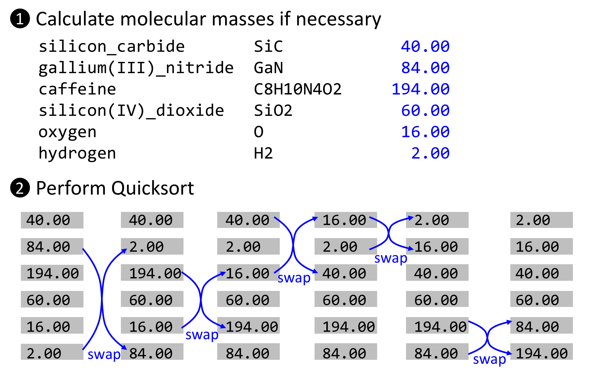
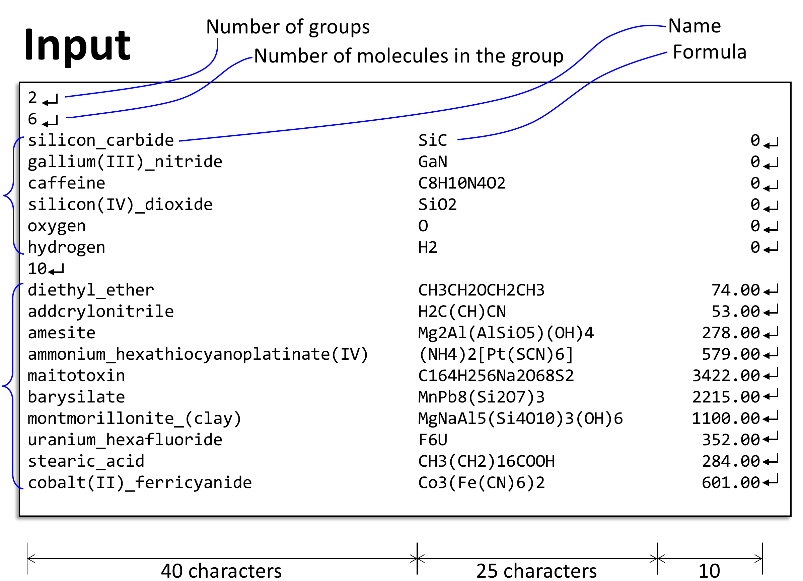
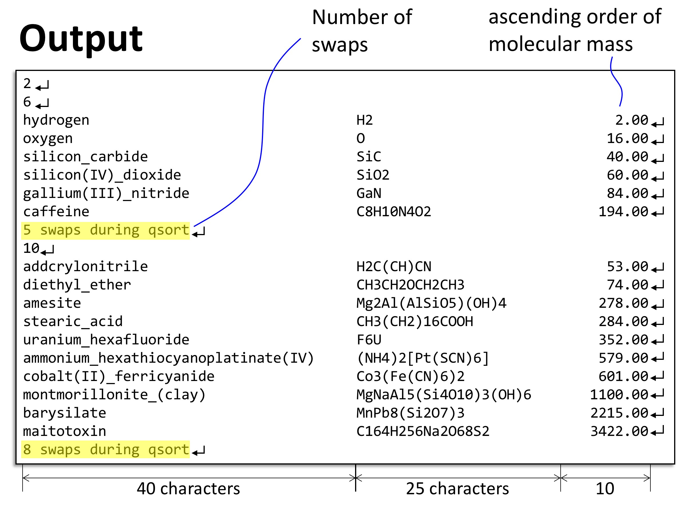

# [QuickSort for Molecules](https://acm.cs.nthu.edu.tw/problem/11943/)
### Description
- Given several groups of molecules
    -  There may be duplicated molecules
 

- Each molecule has
    - A name string (e.g., "caffeine")
    - A formula string (e.g., "C8H10N4O2")
    - Molecular mass (can be zero or non-zero)
        - A zero means that your program needs to calculate the mass (Use this periodic table and double is recommended while calculating the mass )
        - A non-zero value means the mass is given 
 

- Quicksort each group of molecules according to the ascending order of molecular mass
    - Always pick the first entry of each partition as the pivot
    - Do not count swap(array, posi, posj) if posi == posj
 

- Print out **the molecules** and also report **the number of swaps** used during Quicksort
 

- _Processing steps example:_


### Input
- **Note:**
    - The input 1 is the same as sample input/out. 
    - All of the molecular masses in input 2~8 are given. (In other words, only input 9 and 10 need to calculate the masses by your own)


### Output


##### Sample Input
```
2
6
silicon_carbide                         SiC                               0
gallium(III)_nitride                    GaN                               0
caffeine                                C8H10N4O2                         0
silicon(IV)_dioxide                     SiO2                              0
oxygen                                  O                                 0
hydrogen                                H2                                0
10
diethyl_ether                           CH3CH2OCH2CH3                 74.00
addcrylonitrile                         H2C(CH)CN                     53.00
amesite                                 Mg2Al(AlSiO5)(OH)4           278.00
ammonium_hexathiocyanoplatinate(IV)     (NH4)2[Pt(SCN)6]             579.00
maitotoxin                              C164H256Na2O68S2            3422.00
barysilate                              MnPb8(Si2O7)3               2215.00
montmorillonite_(clay)                  MgNaAl5(Si4O10)3(OH)6       1100.00
uranium_hexafluoride                    F6U                          352.00
stearic_acid                            CH3(CH2)16COOH               284.00
cobalt(II)_ferricyanide                 Co3(Fe(CN)6)2                601.00
```

#### Sample Output
```
2
6
hydrogen                                H2                             2.00
oxygen                                  O                             16.00
silicon_carbide                         SiC                           40.00
silicon(IV)_dioxide                     SiO2                          60.00
gallium(III)_nitride                    GaN                           84.00
caffeine                                C8H10N4O2                    194.00
5 swaps during qsort
10
addcrylonitrile                         H2C(CH)CN                     53.00
diethyl_ether                           CH3CH2OCH2CH3                 74.00
amesite                                 Mg2Al(AlSiO5)(OH)4           278.00
stearic_acid                            CH3(CH2)16COOH               284.00
uranium_hexafluoride                    F6U                          352.00
ammonium_hexathiocyanoplatinate(IV)     (NH4)2[Pt(SCN)6]             579.00
cobalt(II)_ferricyanide                 Co3(Fe(CN)6)2                601.00
montmorillonite_(clay)                  MgNaAl5(Si4O10)3(OH)6       1100.00
barysilate                              MnPb8(Si2O7)3               2215.00
maitotoxin                              C164H256Na2O68S2            3422.00
8 swaps during qsort
```